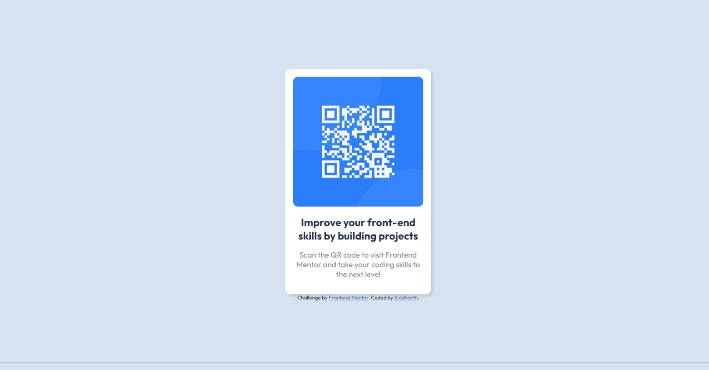

# Frontend Mentor - QR code component solution

This is a solution to the [QR code component challenge on Frontend Mentor](https://www.frontendmentor.io/challenges/qr-code-component-iux_sIO_H). Frontend Mentor challenges help you improve your coding skills by building realistic projects. 

## Table of contents

- [Overview](#overview)
  - [Screenshot](#screenshot)
  - [Links](#links)
- [My process](#my-process)
  - [Built with](#built-with)
  - [What I learned](#what-i-learned)
  - [Continued development](#continued-development)
  - [Useful resources](#useful-resources)
- [Author](#author)

## Overview

### Screenshot

### Links

- Solution URL: [Add solution URL here](https://github.com/Siddharthksidd/Frontend_mentor_Projects-qr-code)
- Live Site URL: [Add live site URL here](https://siddharthksidd.github.io/Frontend_mentor_Projects-qr-code/)

## My process

### Built with

- Semantic HTML5 markup
- CSS custom properties
- Flexbox

### What I learned

This was a basic design but without the figma file it was difficult to figureout the css properties.

At the end, I belive I have done the best I can. Always open to comments.

### Continued development

I would like to make my own QR Generator so this could be used as a default template and also can be include in further projects where a card needs to be included.

The qr code could be links to a document or something along those ways. Going to think about something useful that could come in handy.

### Useful resources

- [Example resource 1](https://www.w3schools.com/) - This helped me for better understanding of the CSS properties.

## Author

- Frontend Mentor - [@Siddharthksidd](https://www.frontendmentor.io/profile/Siddharthksidd)
